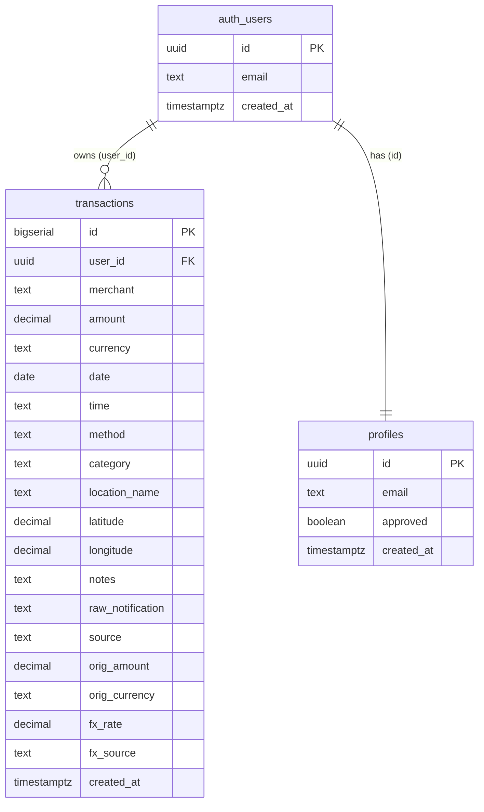

<div dir="rtl">

# כספון — Kaspon 💚

**מעקב הוצאות אישי, אוטומטי ופרטי — שמבין בתי עסק ישראליים.**
דשבורד בעברית (RTL) עם backend על Supabase, שרושם חיובי אשראי אוטומטית מהודעות SMS,
מסווג אותם ל‑22 קטגוריות, וממיר מטבע זר לשקלים — בלי שתצטרך להקליד עסקה אחת.

🔗 **אתר חי:** https://YOUR-PROJECT.vercel.app
💻 **קוד:** https://github.com/YOUR-USERNAME/kaspon

<!-- 📸 הוסף כאן צילום מסך:  -->

---

## 🎯 הבעיה שהמוצר פותר

מעקב אחר הוצאות אשראי בישראל הוא כאב אמיתי:
- החיובים מפוזרים בין כמה מנפיקי כרטיסים (AMEX, max, ישראכרט) — אין תמונה אחת מאוחדת.
- אפליקציות הבנק/האשראי מסווגות בצורה גרועה, ולא מזהות בתי עסק ישראליים כמו שצריך.
- מעקב ידני (אקסל) מתיש ולכן רוב האנשים פשוט מפסיקים לעקוב.
- חיובים במטבע זר מבלבלים — הסכום בשקלים מופיע באיחור ולא ברור לפי איזה שער.

**כספון פותר את זה:** כל חיוב נרשם אוטומטית ברגע שמגיעה הודעת SMS, מסווג לקטגוריה הנכונה,
ומוצג בתמונה אחת נקייה — בעברית, ופרטי לחלוטין.

---

## 👥 קהל היעד

צרכנים ישראלים שמשתמשים בכרטיס/כרטיסי אשראי ורוצים תמונה אוטומטית, מאוחדת ופרטית של
ההוצאות שלהם — בלי להקליד כל קנייה ידנית, ובלי למסור את הנתונים הפיננסיים שלהם לאפליקציה
חיצונית. במיוחד מתאים למי שמחזיק כמה כרטיסים ומאבד את התמונה הכוללת.

---

## ⚔️ מתחרים ובידול

| פתרון קיים | החיסרון שלו | איך כספון שונה |
|---|---|---|
| אפליקציות הבנק / חברת האשראי | מפוצלות לכל מנפיק, סיווג חלש, אין תמונה מאוחדת | מאחד את כל המנפיקים בתמונה אחת, סיווג ישראלי חכם |
| אקסל / מעקב ידני | מתיש, ידני, בלי אוטומציה | רישום אוטומטי מלא מ‑SMS — אפס הקלדה |
| אפליקציות תקצוב (Riseup וכו') | דורשות חיבור לחשבון הבנק, פוגעות בפרטיות, לרוב בתשלום | self-hosted, ה‑Supabase שלך, אף צד שלישי לא רואה את הנתונים |

**הבידול המרכזי:** רישום **אוטומטי** מ‑SMS על פני 3 מנפיקים, סיווג שמכיר מאות בתי עסק
ישראליים, פרטיות מלאה (RLS), והמרת מטבע זר אוטומטית — הכל בעברית.

---

> 🧩 **טכנולוגיית הצד-לקוח:** האפליקציה בנויה ב-**React** (קומפוננטות + hooks) עם **Vite**, ומפורסמת ב-**Vercel** (Vercel בונה את הפרויקט אוטומטית). ה-Backend כולו על **Supabase**.

## ✨ יכולות עיקריות

- **רישום אוטומטי מ‑SMS** — קיצור ב‑iPhone שולח כל הודעת חיוב ל‑Edge Function שמפענח ומסווג.
- **22 קטגוריות** עם זיהוי אוטומטי של מאות בתי עסק ישראליים (מזון, מסעדות, דלק, תחבורה,
  בריאות, כושר, ביגוד, בית, טכנולוגיה, בידור, נסיעות, ילדים, חינוך, חיות מחמד, ועוד).
- **כניסה אישית** עם אימייל וסיסמה, איפוס סיסמה עצמאי, ו**אישור מנהל** למשתמשים חדשים.
- **הפרדה מלאה בין משתמשים** — כל אחד רואה רק את הנתונים שלו (נאכף בצד השרת ב‑RLS).
- **המרת מטבע זר** אוטומטית לשקלים לפי שער ECB ביום העסקה.
- **גרפים, חיפוש, סינון, ייצוא CSV**, ועיצוב מותאם למובייל.

---

## 🗄️ מודל הנתונים (ERD)

ה‑Backend בנוי על Supabase (PostgreSQL). שתי טבלאות עיקריות, שתיהן מקושרות לטבלת
המשתמשים המנוהלת `auth.users`:



- **transactions** — כל עסקה, משויכת למשתמש דרך `user_id`. כוללת סכום, מטבע, תאריך, שעה,
  קטגוריה, אמצעי תשלום, נתוני מטבע זר (`orig_amount`, `fx_rate`...) ומקור (SMS/ידני).
- **profiles** — שורה לכל משתמש עם דגל `approved` למערכת אישור המנהל.
- **אבטחה:** Row Level Security על שתי הטבלאות — כל משתמש ניגש רק לשורות שלו, ורק אם אושר.

---

## 🔌 שירותים חיצוניים ואינטגרציות

| שירות | סוג | למה משמש |
|---|---|---|
| **Supabase Auth** | אוטנטיקציה | כניסת משתמשים (אימייל+סיסמה), ניהול session, איפוס סיסמה |
| **Supabase PostgreSQL + RLS** | בסיס נתונים | אחסון העסקאות והפרדת נתונים מלאה בין משתמשים |
| **Supabase Edge Function** | לוגיקת שרת | פענוח וסיווג ה‑SMS בצד השרת, הסתרת ה‑service_role key, קריאה ל‑API מטבע |
| **Frankfurter API (ECB)** | קריאת API חיצוני | המרת מטבע זר לשקלים לפי שער ביום העסקה |
| **iOS Shortcuts** | אוטומציה | מופעל בהודעת SMS נכנסת ושולח אותה ל‑Edge Function |
| **Chart.js** | ספריית גרפים (CDN) | תרשימי ההוצאות והקטגוריות בדשבורד |
| **Vercel** | אירוח | פרסום האתר החי |

> 🔒 **הסתרת סודות:** ה‑`service_role key` וה‑`KASPON_SECRET` נמצאים אך ורק ב‑Edge Function
> secrets בצד השרת — לעולם לא בקוד הצד‑לקוח. ה‑anon key שבקובץ מוגן על‑ידי RLS.

---

## 🔐 מודל אבטחה

- **Row Level Security** — כל שאילתה מסוננת אוטומטית למשתמש המחובר; ה‑anon key לבדו לא יכול
  לקרוא או לכתוב שום שורה.
- **אישור מנהל** — משתמש חדש נרשם וממתין; רק לאחר אישור (דגל `approved=true`) הוא ניגש לנתונים.
- כל הסודות בצד השרת בלבד. סיסמאות מאוחסנות מוצפנות אצל Supabase.

---

## 🚀 הרצה / פריסה

1. **Supabase:** הרץ ב‑SQL Editor לפי הסדר: `setup.sql`, `migrate-fx.sql`, `migrate-categories.sql`, `approval-setup.sql`.
2. **Edge Function:** פרוס את `index.ts` כפונקציה `log-transaction` עם 3 הסודות, וכבה `Verify JWT`.
3. **דשבורד:** הדבק את ה‑Project URL וה‑anon key ב‑`src/supabaseClient.js`.
4. **Vercel:** ייבא את הריפו ל‑Vercel — הוא מזהה **Vite** ובונה ומפרסם אוטומטית.
5. **Supabase URL Config:** הגדר את כתובת ה‑Vercel ב‑Site URL ו‑Redirect URLs.

---

## 🔑 משתמש דמו (לבדיקה)

> כדי לבדוק את האפליקציה בלי להמתין לאישור מנהל, השתמש בחשבון הדמו:

- **אימייל:** `demo@kaspon.app`
- **סיסמה:** `_________________`

(חשבון הדמו כבר מאושר וכולל נתוני עסקאות לדוגמה.)

---

## 📁 מבנה הפרויקט

```
index.html              — נקודת הכניסה של Vite
package.json            — תלויות הפרויקט (React, Supabase, Chart.js)
vite.config.js          — הגדרות Vite
src/
  main.jsx              — טעינת React אל ה-DOM
  App.jsx               — כל הקומפוננטות והלוגיקה (React + hooks)
  supabaseClient.js     — חיבור ל-Supabase (כאן מדביקים URL + anon key)
  data.js               — 22 הקטגוריות וזיהוי אוטומטי
  index.css             — העיצוב (Frank Ruhl Libre + Heebo, RTL)
─── Backend (Supabase) ───
index.ts                — Edge Function: פענוח SMS + סיווג + המרת מטבע
setup.sql               — טבלת transactions + RLS
migrate-fx.sql          — עמודות מטבע זר
migrate-categories.sql  — הרחבה ל‑22 קטגוריות
approval-setup.sql      — מערכת אישור משתמשים
```

</div>
