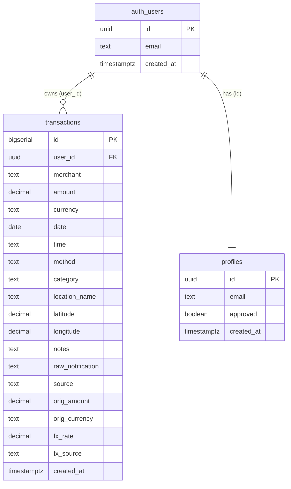

<div dir="rtl">

# כספון — Kaspon 💚

**מעקב הוצאות אישי, אוטומטי ופרטי — שמבין בתי עסק ישראליים.**
דשבורד בעברית (<span dir="ltr">RTL</span>) עם <span dir="ltr">backend</span> על <span dir="ltr">Supabase</span>, שרושם חיובי אשראי אוטומטית מהודעות <span dir="ltr">SMS</span>, מסווג אותם ל‑22 קטגוריות, וממיר מטבע זר לשקלים — בלי שתצטרך להקליד עסקה אחת.

🔗 **אתר חי:** <span dir="ltr">https://kaspon.vercel.app/</span>
💻 **קוד:** <span dir="ltr">https://github.com/GITSTUDY829/Kaspon</span>

<!-- 📸 הוסף כאן צילום מסך:  -->

---

## 🎯 הבעיה שהמוצר פותר

מעקב אחר הוצאות אשראי בישראל הוא כאב אמיתי:
- החיובים מפוזרים בין כמה מנפיקי כרטיסים (<span dir="ltr">AMEX</span>, <span dir="ltr">max</span>, ישראכרט) — אין תמונה אחת מאוחדת.
- אפליקציות הבנק/האשראי מסווגות בצורה גרועה, ולא מזהות בתי עסק ישראליים כמו שצריך.
- מעקב ידני (אקסל) מתיש ולכן רוב האנשים פשוט מפסיקים לעקוב.
- חיובים במטבע זר מבלבלים — הסכום בשקלים מופיע באיחור ולא ברור לפי איזה שער.

**כספון פותר את זה:** כל חיוב נרשם אוטומטית ברגע שמגיעה הודעת <span dir="ltr">SMS</span>, מסווג לקטגוריה הנכונה, ומוצג בתמונה אחת נקייה — בעברית, ופרטי לחלוטין.

---

## 👥 קהל היעד

צרכנים ישראלים שמשתמשים בכרטיס/כרטיסי אשראי ורוצים תמונה אוטומטית, מאוחדת ופרטית של ההוצאות שלהם — בלי להקליד כל קנייה ידנית, ובלי למסור את הנתונים הפיננסיים שלהם לאפליקציה חיצונית. במיוחד מתאים למי שמחזיק כמה כרטיסים ומאבד את התמונה הכוללת.

---

## ⚔️ מתחרים ובידול

| פתרון קיים | החיסרון שלו | איך כספון שונה |
|---|---|---|
| אפליקציות הבנק / חברת האשראי | מפוצלות לכל מנפיק, סיווג חלש, אין תמונה מאוחדת | מאחד את כל המנפיקים בתמונה אחת, סיווג ישראלי חכם |
| אקסל / מעקב ידני | מתיש, ידני, בלי אוטומציה | רישום אוטומטי מלא מ‑SMS — אפס הקלדה |
| אפליקציות תקצוב (<span dir="ltr">Riseup</span> וכו') | דורשות חיבור לחשבון הבנק, פוגעות בפרטיות, לרוב בתשלום | <span dir="ltr">self-hosted</span>, ה‑<span dir="ltr">Supabase</span> שלך, אף צד שלישי לא רואה את הנתונים |

**הבידול המרכזי:** רישום **אוטומטי** מ‑<span dir="ltr">SMS</span> על פני 3 מנפיקים, סיווג שמכיר מאות בתי עסק ישראליים, פרטיות מלאה (<span dir="ltr">RLS</span>), והמרת מטבע זר אוטומטית — הכל בעברית.

---

> 🧩 **טכנולוגיית הצד‑לקוח:** האפליקציה בנויה ב‑**<span dir="ltr">React</span>** (קומפוננטות + <span dir="ltr">hooks</span>) עם **<span dir="ltr">Vite</span>**, ומפורסמת ב‑**<span dir="ltr">Vercel</span>** (<span dir="ltr">Vercel</span> בונה את הפרויקט אוטומטית). ה‑<span dir="ltr">Backend</span> כולו על **<span dir="ltr">Supabase</span>**.

## ✨ יכולות עיקריות

- **רישום אוטומטי מ‑<span dir="ltr">SMS</span>** — קיצור ב‑<span dir="ltr">iPhone</span> שולח כל הודעת חיוב ל‑<span dir="ltr">Edge Function</span> שמפענח ומסווג (מדריך התקנה מלא בהמשך).
- **22 קטגוריות** עם זיהוי אוטומטי של מאות בתי עסק ישראליים (מזון, מסעדות, דלק, תחבורה, בריאות, כושר, ביגוד, בית, טכנולוגיה, בידור, נסיעות, ילדים, חינוך, חיות מחמד, ועוד).
- **כניסה אישית** עם אימייל וסיסמה, איפוס סיסמה עצמאי, ו**אישור מנהל** למשתמשים חדשים — עם המתנה של **עד 24 שעות** עד לאישור.
- **הפרדה מלאה בין משתמשים** — כל אחד רואה רק את הנתונים שלו (נאכף בצד השרת ב‑<span dir="ltr">RLS</span>).
- **המרת מטבע זר** אוטומטית לשקלים לפי שער <span dir="ltr">ECB</span> ביום העסקה.
- **גרפים, חיפוש, סינון, ייצוא <span dir="ltr">CSV</span>**, ועיצוב מותאם למובייל, טאבלט ומחשב.

---

## 🗄️ מודל הנתונים (<span dir="ltr">ERD</span>)

ה‑<span dir="ltr">Backend</span> בנוי על <span dir="ltr">Supabase</span> (<span dir="ltr">PostgreSQL</span>). שתי טבלאות עיקריות, שתיהן מקושרות לטבלת המשתמשים המנוהלת `auth.users`:



- **<span dir="ltr">transactions</span>** — כל עסקה, משויכת למשתמש דרך `user_id`. כוללת סכום, מטבע, תאריך, שעה, קטגוריה, אמצעי תשלום, נתוני מטבע זר (`orig_amount`, `fx_rate`...) ומקור (<span dir="ltr">SMS</span>/ידני).
- **<span dir="ltr">profiles</span>** — שורה לכל משתמש עם דגל `approved` למערכת אישור המנהל.
- **אבטחה:** <span dir="ltr">Row Level Security</span> על שתי הטבלאות — כל משתמש ניגש רק לשורות שלו, ורק אם אושר.

---

## 🔌 שירותים חיצוניים ואינטגרציות

| שירות | סוג | למה משמש |
|---|---|---|
| **<span dir="ltr">Supabase Auth</span>** | אוטנטיקציה | כניסת משתמשים (אימייל+סיסמה), ניהול <span dir="ltr">session</span>, איפוס סיסמה |
| **<span dir="ltr">Supabase PostgreSQL + RLS</span>** | בסיס נתונים | אחסון העסקאות והפרדת נתונים מלאה בין משתמשים |
| **<span dir="ltr">Supabase Edge Function</span>** | לוגיקת שרת | פענוח וסיווג ה‑<span dir="ltr">SMS</span> בצד השרת, הסתרת ה‑<span dir="ltr">service_role key</span>, קריאה ל‑<span dir="ltr">API</span> מטבע |
| **<span dir="ltr">Frankfurter API (ECB)</span>** | קריאת <span dir="ltr">API</span> חיצוני | המרת מטבע זר לשקלים לפי שער ביום העסקה |
| **<span dir="ltr">iOS Shortcuts</span>** | אוטומציה | מופעל בהודעת <span dir="ltr">SMS</span> נכנסת ושולח אותה ל‑<span dir="ltr">Edge Function</span> (<span dir="ltr">iPhone</span> בלבד) |
| **<span dir="ltr">Chart.js</span>** | ספריית גרפים | תרשימי ההוצאות והקטגוריות בדשבורד (נארז עם <span dir="ltr">Vite</span>) |
| **<span dir="ltr">Vercel</span>** | אירוח | פרסום האתר החי + בנייה אוטומטית של פרויקט ה‑<span dir="ltr">React</span> |

> 🔒 **הסתרת סודות:** ה‑`service_role key` וה‑`KASPON_SECRET` נמצאים אך ורק ב‑<span dir="ltr">Edge Function secrets</span> בצד השרת — לעולם לא בקוד הצד‑לקוח. ה‑<span dir="ltr">anon key</span> שבקובץ מוגן על‑ידי <span dir="ltr">RLS</span>.

---

## 🔐 מודל אבטחה

- **<span dir="ltr">Row Level Security</span>** — כל שאילתה מסוננת אוטומטית למשתמש המחובר; ה‑<span dir="ltr">anon key</span> לבדו לא יכול לקרוא או לכתוב שום שורה.
- **אישור מנהל** — כל משתמש חדש שנרשם נכנס למצב המתנה, ועליו להמתין **עד 24 שעות** עד שהמנהל יאשר את החשבון ידנית. רק לאחר שהמנהל מאשר בפועל את ההרשמה (דגל `approved=true`), המשתמש יכול להתחבר ולהיכנס לאפליקציה.
- כל הסודות בצד השרת בלבד. סיסמאות מאוחסנות מוצפנות אצל <span dir="ltr">Supabase</span>.

> ⏳ **חשוב לגבי ההרשמה:** משתמש חדש **אינו** מקבל גישה מיידית. לאחר ההרשמה החשבון נכנס למצב המתנה, ויש להמתין **עד 24 שעות** עד שמנהל המערכת יאשר אותו ידנית. עד שהאישור מתקבל, לא ניתן להיכנס לאפליקציה. כדי לבדוק את המערכת מיד וללא המתנה — השתמש בחשבון הדמו שבהמשך.

---

## 📱 מדריך: הקמת רישום SMS אוטומטי — **לאייפון (iPhone) בלבד**

> ⚠️ **חשוב מאוד:** התכונה הזו עובדת **רק במכשירי אייפון (<span dir="ltr">iOS</span>)**, דרך אפליקציית **<span dir="ltr">Shortcuts</span>** והאוטומציות של הודעות. **אין לה מקבילה באנדרואיד** — משתמשי אנדרואיד יכולים להוסיף עסקאות ידנית בלבד מתוך הדשבורד.

**איך זה עובד:** כשמגיעה הודעת <span dir="ltr">SMS</span> על חיוב אשראי, אוטומציה באייפון לוקחת את תוכן ההודעה ושולחת אותו ל‑<span dir="ltr">Edge Function</span>. השרת מפענח את ההודעה (סכום, בית עסק, תאריך, מטבע), מסווג לקטגוריה הנכונה, ושומר את העסקה במסד — בלי שתקליד כלום.

### שלב א — הכנת ה‑<span dir="ltr">Edge Function</span> (פעם אחת, בצד השרת)

1. ב‑<span dir="ltr">Supabase</span> → **<span dir="ltr">Edge Functions</span>** → **<span dir="ltr">Create a new function</span>** → שם: `log-transaction`.
2. הדבק את כל הקוד מהקובץ `edge-function-log-transaction.ts` → **<span dir="ltr">Deploy</span>**.
3. **<span dir="ltr">Edge Functions → Manage secrets</span>** → הוסף 3 סודות:
   - `KASPON_SECRET` — מחרוזת אקראית ארוכה. ⚠️ **אלפאנומרית בלבד** (אותיות ומספרים) — תווים מיוחדים גורמים לשגיאת <span dir="ltr">"network connection lost"</span> באייפון.
   - `KASPON_USER_ID` — ה‑<span dir="ltr">User ID</span> שלך (מופיע בדשבורד → טאב "הגדרות").
   - `SUPABASE_SERVICE_ROLE_KEY` — מתוך <span dir="ltr">Settings → API → service_role key</span>.
4. ⚠️ כבה את הטוגל **<span dir="ltr">Verify JWT</span>** (הוא נדלק מחדש לבד אחרי כל פריסה — זו סיבה נפוצה לשגיאת 401).
5. העתק את כתובת הפונקציה:
   `https://YOUR-PROJECT-REF.supabase.co/functions/v1/log-transaction`

### שלב ב — יצירת האוטומציה באייפון

1. פתח את אפליקציית **<span dir="ltr">Shortcuts</span>** → לשונית **<span dir="ltr">Automation</span>** (למטה) → **+** (למעלה) → **<span dir="ltr">Create Personal Automation</span>**.
2. בחר **<span dir="ltr">Message</span>** → סמן **<span dir="ltr">Message Contains</span>**, והקלד מילה שמופיעה בהודעות החיוב שלך (למשל שם המנפיק, או מילה כמו "כרטיס" / "עסקה"). אפשר ליצור אוטומציה **נפרדת לכל מנפיק** (<span dir="ltr">AMEX</span>, <span dir="ltr">max</span>, ישראכרט) כדי לכסות את כל הכרטיסים.
3. בחר **<span dir="ltr">Run Immediately</span>** ✅ וכבה **<span dir="ltr">Notify When Run</span>** — כך זה ירוץ בשקט בלי אישור בכל פעם.
4. לחץ **<span dir="ltr">Next</span>** → הוסף פעולה **<span dir="ltr">Get Contents of URL</span>** והגדר אותה כך:
   - **<span dir="ltr">URL</span>:** כתובת הפונקציה שהעתקת בשלב א.
   - **<span dir="ltr">Method</span>:** `POST`.
   - תחת **<span dir="ltr">Headers</span>** הוסף שני שדות:
     - `x-kaspon-secret` → ה‑`KASPON_SECRET` שלך
     - `Content-Type` → `application/json`
   - תחת **<span dir="ltr">Request Body</span>** בחר **<span dir="ltr">JSON</span>** והוסף שדה אחד:
     - מפתח: `sms` → ערך: המשתנה **<span dir="ltr">Shortcut Input</span>** (זהו תוכן הודעת ה‑<span dir="ltr">SMS</span>).
5. לחץ **<span dir="ltr">Done</span>** לשמירה.

מעכשיו — כל הודעת חיוב תואמת תירשם **אוטומטית** בדשבורד, כולל סכום, בית עסק, תאריך וקטגוריה.

> ℹ️ הרישום האוטומטי מוגדר לחשבון **הבעלים** בלבד (לפי `KASPON_USER_ID`). משתמשים נוספים שתאשר יכולים להוסיף עסקאות ידנית מתוך הדשבורד.

---

## 🚀 הרצה / פריסה

1. **<span dir="ltr">Supabase</span>:** הרץ ב‑<span dir="ltr">SQL Editor</span> לפי הסדר: `setup.sql`, `migrate-fx.sql`, `migrate-categories.sql`, `approval-setup.sql`, `fix-warnings.sql`.
2. **<span dir="ltr">Edge Function</span>:** פרוס את `edge-function-log-transaction.ts` כפונקציה `log-transaction` עם 3 הסודות, וכבה `Verify JWT` (ראה מדריך ה‑<span dir="ltr">SMS</span> למעלה).
3. **דשבורד:** ה‑<span dir="ltr">Project URL</span> וה‑<span dir="ltr">anon key</span> מקובעים ב‑`supabaseClient.js` (ה‑<span dir="ltr">anon key</span> בטוח לפרסום — <span dir="ltr">RLS</span> מגן על הנתונים).
4. **<span dir="ltr">Vercel</span>:** ייבא את הריפו ל‑<span dir="ltr">Vercel</span> — הוא מזהה **<span dir="ltr">Vite</span>** ובונה ומפרסם אוטומטית.
5. **<span dir="ltr">Supabase URL Config</span>:** הגדר את כתובת ה‑<span dir="ltr">Vercel</span> ב‑<span dir="ltr">Site URL</span> ו‑<span dir="ltr">Redirect URLs</span>.

---

## 🔑 משתמש דמו (לבדיקה)

> כדי לבדוק את האפליקציה בלי להמתין לאישור מנהל (עד 24 שעות), השתמש בחשבון הדמו:

- **אימייל:** `demo@kaspon.app`
- **סיסמה:** `_________________`

(חשבון הדמו כבר מאושר וכולל נתוני עסקאות לדוגמה.)

---

## 📁 מבנה הפרויקט

```
─── Frontend (React + Vite) ───
index.html              — נקודת הכניסה של Vite
package.json            — תלויות הפרויקט (React, Supabase, Chart.js)
vite.config.js          — הגדרות Vite
main.jsx                — טעינת React אל ה-DOM
App.jsx                 — כל הקומפוננטות והלוגיקה (React + hooks)
supabaseClient.js       — חיבור ל-Supabase (URL + anon key מקובעים)
data.js                 — 22 הקטגוריות וזיהוי אוטומטי
index.css               — העיצוב (Frank Ruhl Libre + Heebo, RTL)
─── Backend (Supabase) ───
edge-function-log-transaction.ts  — Edge Function: פענוח SMS + סיווג + המרת מטבע
setup.sql               — טבלת transactions + RLS
migrate-fx.sql          — עמודות מטבע זר
migrate-categories.sql  — הרחבה ל‑22 קטגוריות
approval-setup.sql      — מערכת אישור משתמשים
fix-warnings.sql        — חיזוק אבטחה
```

</div>
